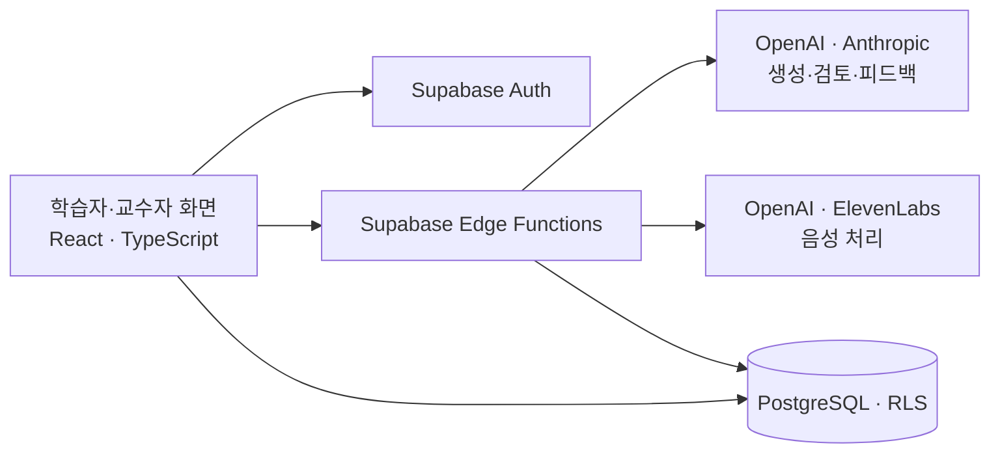

  

**표현을 판단하고, 직접 번역·통역하고, 피드백을 검토하는 한·중 화용 학습 웹앱입니다.**
교수자의 콘텐츠 생성·검수·수업 편성과 학습자의 수행·기록을 하나의 흐름으로 연결합니다.
박사학위논문 「AI 기반 한·중 통번역 학습 워크플로우 개발 연구」의 설계·개발 산출물입니다.

**[대표 미션 체험](https://pragma.up.railway.app/demo/mission) · [기술 구조](#기술-구조) · [검증 근거](#검증-근거)**

대표 미션은 로그인 없이 공개 예시로 체험할 수 있습니다. 예시 피드백을 사용하며 답안은 서버에 저장하지 않습니다. 실제 수업은 로그인·교수자 승인 후 이용합니다.

## 구현한 것

| 기능 | 구현 |
|---|---|
| 콘텐츠 파이프라인 | 조건별 생성 → 규칙 검사·복수 AI 검토 → 교수자 최종 승인 |
| 수업·학습 흐름 | 15주 강좌 편성 → MJT 5개 판단 과제 → DCT형 통번역 산출 → 피드백 검토·수정 |
| 수행 추적 | 생성 조건·콘텐츠 판본·검토 결과·최초안·수정안·학습자 이견 기록 |

승인된 미션만 수업에 배치합니다. 학습자는 피드백에 따라 수정하거나, 근거를 남기고 최초안을 유지할 수 있습니다.

## 기술 구조

| 영역 | 구성 |
|---|---|
| 프론트엔드 | React · TypeScript · Vite · Tailwind CSS / Railway 호스팅 |
| 데이터·권한 | Supabase PostgreSQL · Auth · Row Level Security |
| 생성·검토 | OpenAI 생성·검토 + Anthropic 교차 검토 / 승인 권한은 교수자에게 유지 |
| 검증·배포 | Vitest · TypeScript · DB 승인 경계 검사 · GitHub Actions / main 기반 배포 |

프롬프트·콘텐츠 판본과 검토 결과를 연결해 추적합니다.
프롬프트 해시는 동일한 AI 산출물의 재생성을 보장하지 않습니다.

## 검증 근거

**2026-09-05 main 기준:** 자동 테스트 **727개 통과·9개 건너뜀**, 배포 정책 검사 **5개**,
로컬 PostgreSQL 승인 경계 검사 **7개** 통과. 타입 검사·운영 빌드도 통과했습니다.
[해당 CI 결과](https://github.com/sylim-research/PRAGMA/actions/runs/33953180630)

- [현행 설계·구현 정본](docs/CANONICAL.md)
- [설계 결정 기록](docs/research-trail/02_decision_log.md) · [검증 근거 색인](docs/research-trail/04_evidence_index.md)
- [기술 안내·로컬 실행](docs/TECHNICAL_OVERVIEW.md) · [코드·의존성](package.json) · [자동 검증 설정](.github/workflows/ci.yml)

콘텐츠 생성·내부 점검은 진행 중이며, 관련 분야 전문가 3인의 형성평가는 계획 단계입니다.
자동 테스트 결과를 학습효과 또는 전문가 평가 결과로 해석하지 않습니다.

메인 화면 보기

[소프트웨어 인용](CITATION.cff) · [공개·이용 범위](LICENSE)

Copyright (c) 2026 Soyoung Lim
