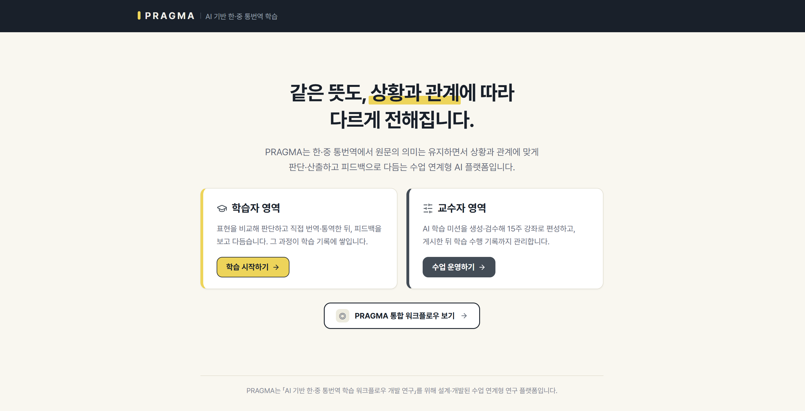
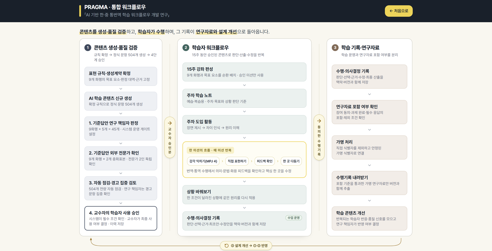

# PRAGMA

> **AI 기반 한·중 통번역 학습 워크플로우 개발 연구**

[](https://pragma.up.railway.app)


**같은 뜻이라도 상황과 관계에 따라 적절한 표현은 달라집니다.**

PRAGMA는 이 **화용적 적절성**을 한·중 통번역 학습의 중심 과제로 다룹니다.
학습자는 표현 후보를 비교해 판단하고, 직접 번역·통역한 뒤, 피드백을 검토해 수정합니다.

<p align="center">
  
  <br>
  <sub><b>메인 화면</b> · 학습자·교수자 진입</sub>
</p>

<p align="center">
  
  <br>
  <sub><b>통합 워크플로우</b> · 콘텐츠 생성 → 검수·승인 → 수업 배치 → 학습 수행 → 기록</sub>
</p>

<br>

## 연구 설계와 시스템 구현

| 설계 원칙 | 시스템 구현 |
|---|---|
| **판단 선행 설계** | 적절성 판단(MPJ 5문항) → 번역·통역 산출 → 피드백 검토 → 표적 수정 |
| **생성·승인 권한 분리** | AI 생성·자동 검사는 후보 제안까지 — 수업 배치는 교수자 승인 콘텐츠만 |
| **수행 과정 기록** | 판단 · 선택 근거 · 최초안 · 수정안을 맥락·버전과 함께 저장 |
| **생성 조건 추적** | 프롬프트 스냅숏·해시 고정, CI 결정성 검증 |

<br>

## 개발 현황

| 구분 | 내용 |
|---|---|
| 구현 완료 | 학습자·교수자 워크플로우, 15주 강좌 편성, 학습 수행 기록 저장 |
| 구현 완료 | 콘텐츠 품질 관리 절차 — 규칙 기반 검사, 복수 AI 모델 교차 검토, 교수자 승인 |
| 진행 중 | 정식 학습 문항 대량 생성과 외부 전문가 검토 |
| 계획 | 학습 수행 데이터 수집과 생성 조건별 품질 분석 |

---

> [!NOTE]
> PRAGMA는 최적 번역을 자동으로 제시하는 번역기나 범용 LMS가 아닙니다. 화행과 상황 조건을 통제해 학습 콘텐츠를 만들고, 교수자가 승인한 미션만 수업에 배치하며, 학습자의 판단·산출·수정을 버전과 함께 기록합니다.

<br>

## 연구·교육적 목적

PRAGMA는 다음 요소를 실제 학습 기능에 연결합니다.

- 요청·거절·감사·사과·제안·초대·반대·칭찬·직접 불만의 9개 화행
- 상대적 권력(Power), 사회적 거리(Distance), 상황 부담(Risk/Imposition)의 맥락 조건
- 한→중·중→한 언어 방향과 번역·통역 수행 방식
- 입문·중급·고급의 교육 지원 수준
- 상황 판단 → 직접 산출 → 피드백 검토 → 필요 시 수정 → 수행 기록의 학습 순환

<br>

## 핵심 워크플로우

<br>

### 콘텐츠 생성·검수

```text
화행·수준·모드·방향·P/D/R·주제 조건
→ 시나리오 코어 생성
→ 선택 코어를 Full Mission으로 조립
→ 규칙 기반 검사
→ 프롬프트 통제 기반 AI 검토
→ 교수자 검수·승인
→ 15주 강좌의 주차에 배치
```

- 시나리오 코어는 상황·관계·원문·선행 발화와 생성 조건을 담고, 판단 문항이나 참고안은 포함하지 않습니다.
- 코어 생성은 strict JSON Schema를 사용합니다.
- 선택한 코어만 `mission_v5` Full Mission으로 조립합니다. 신규 미션은 생성 직후 `generated`이며, 교수자가 공개 가능하다고 판단한 뒤에만 `reviewed`가 됩니다.
- 규칙 검사와 AI 검토에는 승인 권한이 없습니다. AI 모델 간 독립 검토 결과도 읽기 전용 결함 탐지 자료이며, 이견은 연구자 판단으로 넘깁니다.
- 프롬프트·스키마·콘텐츠 계열이 바뀌면 지문과 release를 분리해 구세대 콘텐츠와 섞지 않습니다.

<br>

### 학습자 수행

공식 학습 경로는 교강사가 게시한 15주 수업입니다.

```text
수업·주차 선택
→ 도입 장면과 Can-do·예습 자료
→ 표현 감각 익히기(MPJ 5문항)
→ 직접 번역하기 또는 직접 통역하기(DCT 1회)
→ 의미·문법·상황 적절성 피드백
→ 필요 시 한 번 다듬기
→ 최초안·수정안·판단 기록 확인
```

현행 학습 미션은 **MPJ5 + DCT1**입니다. 피드백과 수정은 독립 미션이 아니라 DCT 뒤에 이어지는 단계입니다.

1. `Scale4`: 첫인상을 4점으로 판단하되 적절/부적절 방향을 중심으로 비교합니다.
2. `Judge3`: 같은 화행을 조건이 다른 장면에 놓고 과소·적정·과잉을 판단합니다.
3. `FixChoice`: 부적절 여부를 판단한 뒤 서로 다른 적절한 수정안 두 개를 고릅니다.
4. `Reason`: 해당 표현이 상황에 맞지 않는 가장 큰 이유 하나를 고릅니다.
5. `MultiJudge`: 여러 초안을 한 화면에서 비교해 BEST와 WORST를 하나씩 고릅니다.
6. `DCT`: 같은 화용 초점의 새 사건을 직접 번역하거나 통역합니다.

AI 피드백은 의미·의도 충실성, 명백한 문법·형식 문제, 상황 적절성을 분리합니다. 세 층이 모두 통과하면 수정을 강제하지 않고, 수정이 필요한 경우에는 최초안과 실질적으로 다른 답을 작성해야 완료할 수 있습니다. AI 판정과 다르다는 이유만으로 점수나 화용 능력 지표를 만들지 않으며, 학습자는 이견을 남길 수 있습니다.

<br>

### 교수자 운영

관리자 화면은 콘텐츠 CRUD가 아니라 생성부터 수업 배치까지의 게이트를 운영합니다.

- 실제자료 분석과 콘텐츠 후보 추출
- 조건을 지정한 개별 코어 생성과 승인된 배치 실행
- 셀·상태별 라이브러리 탐색과 코어→미션 조립
- 규칙 검사·AI 검토 근거를 포함한 교수자 검수와 `reviewed` 승인
- 강좌 설정, AI 자동 편성, 주차별 조정을 통합한 15주 교과목 설계
- 학습자 접근·참여 상태와 수행·의사결정 기록 조회
- 프롬프트 지문과 AI 독립 검토 결과의 읽기 전용 확인

<br>

## 연구 추적 구조

PRAGMA는 결과물뿐 아니라 결과가 만들어지고 검토된 조건을 연결해 남깁니다.

| 단계 | 남기는 핵심 기록 |
|---|---|
| 콘텐츠 생성 | generation run, 생성 조건, model/provider, schema·prompt version |
| 프롬프트 | Edge 실행 정본의 snapshot과 hash, 저장 콘텐츠와의 지문 일치 여부 |
| 자동 점검 | 결정론적 검사와 프롬프트 통제 기반 검토 |
| 검수·승인 | 생성 상태와 교수자 검수·승인 상태의 분리 |
| 학습 수행 | MPJ 선택 trace, 최초 산출, 피드백 snapshot, 수정 산출, 학습자 이견 |
| 설계 연구 | 설계 추적, 결정, 반복 개발, 증거 색인 |

> [!IMPORTANT]
> 학습 기록은 수업 운영을 위한 것이며, 별도 동의 없이 연구 자료로 사용하지 않습니다.

<br>

## 기술 스택

| 영역 | 현재 구성 |
|---|---|
| 프론트엔드 | React 18.3, Vite 5.4, TypeScript 5.8, React Router 6.30 |
| UI | Tailwind CSS 3.4, Radix UI·shadcn/ui 계열 컴포넌트 |
| 상태·데이터 | TanStack Query 5, Zod 3 |
| 백엔드 | Supabase JS 2.106, Postgres, Auth, RLS, Edge Functions |
| AI 콘텐츠 | OpenAI Chat Completions: `gpt-4.1-mini`, `gpt-4o`, `gpt-4.1` |
| 학습자 피드백 | `gpt-4.1-mini`, 가용성 대체 `gpt-4o-mini` |
| 음성 | OpenAI `gpt-4o-transcribe`, ElevenLabs `eleven_multilingual_v2`, OpenAI TTS 대체 경로 |
| 배포 | Railway 정적 프론트엔드 + Supabase 백엔드 |
| 검증 | Vitest 3, Testing Library, Playwright, ESLint, TypeScript |

<br>

## 테스트·검증

- `npm run typecheck`: 애플리케이션 TypeScript 검사
- `npm test`: Vitest 단위·계약·회귀검사
- `npm run build`: 프롬프트 snapshot 생성과 production build
- `tests/`: Playwright 기반 시나리오 검증과 보조 스크립트
- `scripts/manual-checks/`: 음성 round-trip·피드백·품질 점검용 승인형 수동 검사

<br>

## 연구 정보

이 저장소는 박사학위논문 「AI 기반 한·중 통번역 학습 워크플로우 개발 연구」의 설계·개발 산출물입니다.

---

Copyright (c) 2026 Soyoung Lim
